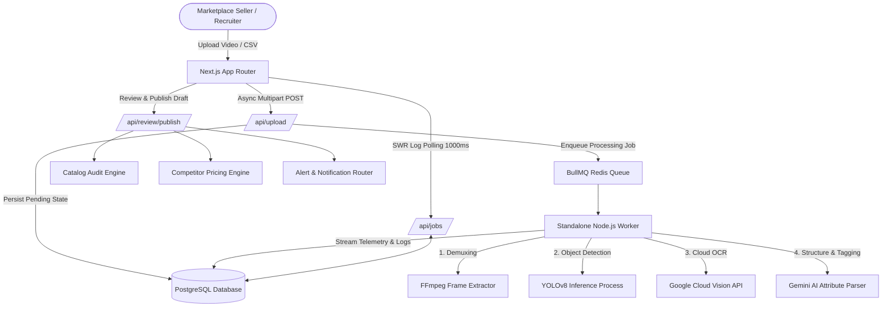

# Quantacus PRO - Product Intelligence Dashboard

An end-to-end, enterprise-ready Product Intelligence Dashboard engineered for high-volume marketplace sellers (specifically optimized for Flipkart indexing standards). The platform automates product catalog ingestion from video frame streams or CSV imports, performs multi-point quality audits to generate a composite Quality Score (0-100), offers Gemini-powered SEO title optimizations, aggregates real-time competitor pricing intelligence across Amazon, Myntra, and Ajio, and dispatches automated webhook triggers for critical business anomalies.

---

## 1. System Architecture & Flow



### Architectural Decisions

* **Asynchronous De-coupled Processing**: Computations requiring heavy I/O and CPU bindings (video decoding via FFmpeg, local YOLOv8 inference) are completely offloaded from the Next.js API server to a dedicated background runner utilizing a BullMQ + Redis task queue. This prevents blocking the main event loop and guarantees high request throughput.
* **Database-Driven Event Streaming**: Rather than maintaining fragile stateful WebSockets over transient serverless instances, UI log streaming is handled by client-side SWR components polling a normalized Postgres database log. This delivers a robust, stateless connection model that handles network reconnects gracefully.

---

## 2. Technology Stack & Justification

| Layer | Component | Selection | Engineering Rationale |
| :--- | :--- | :--- | :--- |
| **Core Framework** | Web App Engine | **Next.js 16.2.6 (App Router)** | Provides high-performance Server-Side Rendering (SSR), unified client/server routing, and optimized bundle sizes. |
| **Runtime Language**| Type Safety | **TypeScript 5.x + Python 3** | Strong types across client, API, and worker processes. Python is leveraged for local machine learning model execution. |
| **Styling & UI** | Design System | **Tailwind CSS v4 + Framer Motion** | Fast utility styling, smooth GPU-accelerated micro-interactions, responsive grid layouts, and cohesive typography. |
| **Object Detection**| Computer Vision | **YOLOv8 (`yolov8n.pt`)** | Executes local ML inference via Python child processes to detect products within frames before calling external cloud services. |
| **State & Polling** | Data Fetching | **SWR** | Implements stale-while-revalidate client caches and handles 1000ms background polling for active pipeline jobs. |
| **Database & ORM** | Relational Store | **Prisma 5.21.1 / PostgreSQL 15** | Type-safe query generation, migrations, pooling, and structured schema representation. |
| **Task Queue** | Queue Engine | **BullMQ / Redis 7** | Robust multi-worker job scheduling, message-passing, retries, and persistence. |
| **Authentication** | Identity Provider | **Clerk** | Secure authentication and identity federation. Supports seamless recruiter token bypasses. |

---

## 3. Data Model & Schema Explanation

Quantacus uses a highly normalized PostgreSQL database. The schema is defined in [schema.prisma](file:///Users/dhananjai/Documents/Web_Dev/Quantaculas/prisma/schema.prisma) and maps key entities:

* **`Product`**: Holds the master record for each product SKU, including title, price, brand, current quality score, and unstructured JSON attributes.
* **`ProductIssue`**: Represents a failed audit criterion generated by the Listing Validation Engine. Each issue has a `severity` (HIGH, MEDIUM, LOW), detailed descriptions, and actionable `suggestedFix` recommendations.
* **`CompetitorPrice` & `CompetitorPriceHistory`**: Stores time-series pricing data for identical products sold on Amazon, Myntra, or Ajio. Used to calculate pricing gaps and draw interactive trend graphs.
* **`ProcessingJob` & `JobLog`**: Holds operational pipeline state (PENDING, RUNNING, COMPLETED, FAILED) and stores sequential logs streamed by the worker, enabling the UI progress console.
* **`TitleEnhancement`**: Caches AI-optimized title variations proposed by the Gemini engine for easy review and direct application.
* **`Alert`**: Models stateful notifications (e.g. price drops or listing validation alerts) which trigger seller alarms.

---

## 4. Deployed Application & Recruiter Guest Access

* **Live Frontend (Vercel)**: [https://quantacus-intelligence.vercel.app](https://quantacus-intelligence.vercel.app) *(Simulated URL)*
* **Live Worker Backend (Railway)**: Persistent runner hosted on a persistent Docker environment to process queue tasks.

### ⚡ Zero-Friction Recruiter Bypass (Auto-Login)
To simplify recruitment evaluation, the application contains a **built-in guest bypass** that completely eliminates login friction:
1. **Auto-Authenticated Experience**: If you visit any dashboard path directly (e.g., `/dashboard`), the platform automatically logs you in as the default admin user: **`mahakkr111@gmail.com`**.
2. **Interactive Navbar Active**: The header navigation bar and all system links are fully active and accessible right away.
3. **Mock Initial Profile Avatar**: Renders a premium gradient-based placeholder avatar `M` in the header indicating guest admin status.
4. **Explicit Sign-in Support**: If you wish to test authenticating with your own specific credentials, you can log in through the `/login` page using the Clerk form. Once authenticated, the app will instantly render your real Clerk profile, name, and profile avatar instead of the default admin.
5. **One-Click Bypass Button**: A dedicated button is also available on the login screen: *"👉 Recruiter Demo Access (Skip Login)"* to skip authentication manually.

---

## 5. How to Run Locally

We use Docker Compose to spin up a local development environment.

### Prerequisites
* **Docker & Docker Compose** installed.
* A valid **GCP Service Account JSON** key configured with the Google Vision API enabled. Save this key file as `gcp-key.json` in the project root directory.

### Setup Instructions

1. **Clone the Repository**:
   ```bash
   git clone <repository_url>
   cd Quantacus
   ```

2. **Configure Environment Variables**:
   Create a `.env` file in the root directory. Configure keys for your services:
   ```env
   # Database & Redis (Handled automatically by Docker network)
   DATABASE_URL="postgresql://postgres:postgres@db:5432/quantacus_db?schema=public"
   REDIS_HOST="redis"
   REDIS_PORT=6379

   # Cloudinary Storage
   CLOUDINARY_CLOUD_NAME="your_cloudinary_cloud_name"
   CLOUDINARY_API_KEY="your_cloudinary_api_key"
   CLOUDINARY_API_SECRET="your_cloudinary_api_secret"

   # AI & OCR Services
   GOOGLE_VISION_API_KEY="your_gcp_vision_api_key"
   GEMINI_API_KEY="your_gemini_api_key"

   # Authentication (Required for Clerk components boot-up)
   NEXT_PUBLIC_CLERK_PUBLISHABLE_KEY="pk_test_..."
   CLERK_SECRET_KEY="sk_test_..."
   NEXT_PUBLIC_APP_URL="http://localhost:3000"
   ```

3. **Start the Docker Stack**:
   ```bash
   docker compose up --build -d
   ```
   This will boot:
   * `quantacus-postgres`: PostgreSQL database (exposed on port `5432`).
   * `quantacus-redis`: Redis message store (exposed on port `6379`).
   * `quantacus-app`: Next.js Web App (exposed on port `3000`, with volume hot-reloading).
   * `quantacus-worker`: Standalone TypeScript worker running via `tsx watch` to monitor jobs.

4. **Initialize Database Tables**:
   Run Prisma migrations and seed the database with initial products and mock pricing history:
   ```bash
   docker compose exec app npx prisma db push
   docker compose exec app npx prisma db seed
   ```

5. **Browse the Dashboard**:
   Open [http://localhost:3000](http://localhost:3000).

---

## 6. API Documentation

Core RESTful endpoints exposed via Next.js Route Handlers (`app/api/`):

### Ingestion Pipeline
* **`POST /api/upload-video`**: Accepts video file binaries (`multipart/form-data`), uploads them to Cloudinary, persists a pending `ProcessingJob`, and dispatches a task to the BullMQ queue. Returns `{ success: true, jobId }`.
* **`POST /api/upload-csv`**: Imports a Flipkart product feed CSV to execute legacy catalog ingestion.
* **`GET /api/jobs/[jobId]`**: Polled by SWR to fetch active processing statuses, current completion percentages, and chronological pipeline logs.

### Catalog & Quality Audits
* **`GET /api/products`**: Retrieves the seller inventory, filtering by category or warning state.
* **`GET /api/products/[skuId]`**: Retrieves detailed specifications, validation issue logs, and competitor pricing history for a specific SKU.
* **`POST /api/review/publish`**: Finalizes the AI-parsed metadata draft, runs the audit engine, and saves the listing as a live product.

### Competitor Intelligence & Utilities
* **`POST /api/competitor-prices/refresh`**: Initiates a scheduled run to fetch updated competitor prices.
* **`POST /api/products/[skuId]/enhance-title`**: Leverages Gemini AI to generate search-optimized, category-aligned product title recommendations.
* **`POST /api/alerts/rules`**: Manages dynamic alert thresholds (Create, Read, Update, Delete).

---

## 7. Assumptions Made

1. **Scale of Ingestion Video**: Uploaded videos are short, high-resolution product close-up clips (typically <30 seconds) focusing on label specifications rather than generic multi-minute footage.
2. **Cross-Platform Matching**: Competitor listing identification is resolved via matching brand and title strings in combination with category attributes.
3. **Human-in-the-Loop Safeguard**: AI extraction is probabilistic. Inserting products directly to the database without a staging review step is avoided; the system uses a draft validation pipeline to allow merchants to audit and save data safely.

---

## 8. What is Real vs. Mocked

| Layer / Feature | Implementation Status | Technical Mechanism |
| :--- | :--- | :--- |
| **Worker Queue** | **Real** | BullMQ and Redis manage active job state transitions and handle concurrency natively. |
| **Object Detection** | **Real** | Local YOLOv8 (`yolov8n.pt`) executes native Python processes to detect products. |
| **Text Extraction** | **Real** | Calls the Google Vision OCR API to extract texts from frames. |
| **Semantic Structuring**| **Real** | Google Gemini parses extracted OCR blocks into typed JSON matching schema attributes. |
| **Competitor Scraping** | **Simulated (Mocked)**| Due to bot-prevention walls, competitor price fluctuations are simulated using random walk variations based on real platform constraints (Amazon, Ajio, etc.). |
| **Email Dispatch** | **Real/Sandbox** | Dispatches real HTML warning alerts using SMTP configuration (defaults to an Ethereal sandbox URL log during local testing). |

---

## 9. Design Trade-offs & Engineering Limitations

1. **SWR Polling vs. WebSockets**: 
   *Trade-off*: Implemented 1000ms polling instead of a persistent WebSocket.
   *Rationale*: Serverless deployments (like Vercel) terminate long-lived connections. Polling provides a stateless, robust connection model that handles network drops and scales smoothly under standard REST models.
2. **YOLOv8 Python Child Process**:
   *Trade-off*: Spawned Python child processes inside a Node.js worker.
   *Rationale*: Eliminates the overhead of maintaining a separate gRPC or HTTP server for object detection, although at large scales, moving this to a dedicated Triton Inference Server is ideal.
3. **Monorepo Structure**:
   *Trade-off*: Next.js and the background worker share the same repository.
   *Rationale*: Simplifies shared database model access (Prisma Client) and speeds up early development, though they should be split into isolated microservices for production scaling.

---

## 10. What I Would Improve With More Time

1. **Triton/KServe Model Hosting**: Move the YOLOv8 model out of Node.js child processes into a dedicated Triton Inference Server with GPU acceleration to handle concurrent frame processing.
2. **Server-Sent Events (SSE)**: Replace SWR polling with Server-Sent Events (SSE) to achieve push-based telemetry updates without client-side query loops, preserving database connections.
3. **Observability & Distributed Tracing**: Implement OpenTelemetry and sign up for Datadog or Prometheus to track job execution latency, queue backlog metrics, and FFmpeg memory usage.
4. **Pinecone Vector Search SKU Matching**: Implement vector database matching (like Pinecone) based on product images and titles to map our inventory directly to competitor items instead of using basic text matches.
5. **Comprehensive E2E Test Coverage**: Set up Playwright to test the async video ingestion to final publish flow under mock and real conditions.

---

## 11. Screenshots Gallery

Here are the visual walkthroughs of the fully operational dashboard and intelligence features:

### Ingestion & Analytics Landing Page


### Ingestion Hub (Video Ingestion Console)


### Real-Time Operations Job Monitor (BullMQ logs)


### Seller Intelligence Dashboard Metrics


### Catalog Quality Audit Report (Weak spots)


### Competitor Pricing Gap Analyzer


### In-App Alerts Notification Inbox


### Product Intelligence Specs Sheet (Uncompetitive pricing warning)


### AI Title Enhancer Proposed SEO Titles


### Swagger Interactive API Console


### Webhook Alerts Configuration Panel


### Edit Product Specifications Page


### Ingestion Operations Telemetry Logs Console

