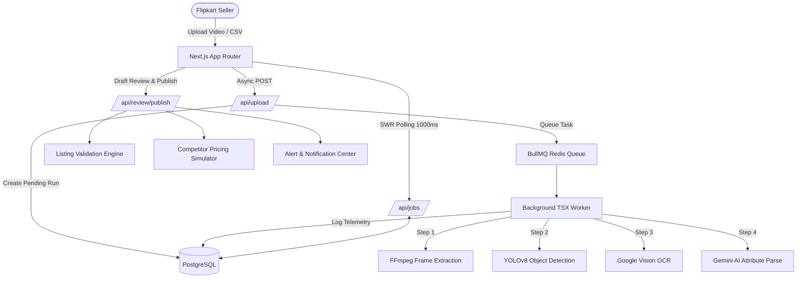

# Product Intelligence Dashboard (Quantacus PRO)

An end-to-end, production-grade Product Intelligence Dashboard built for e-commerce sellers on Flipkart. It automates catalog ingestion via video frames or CSV feeds, audits listing quality against platform indexing standards (yielding a 0-100 Quality Score), provides AI-enhanced SEO suggestions, visualizes competitor pricing across nodes (Amazon, Myntra, Ajio), and emits real-time webhook alerts for critical metric deviations.


---


## 1. System Architecture



---

## 2. Tech Stack

| Layer | Technology | Justification |
| --- | --- | --- |
| **Frontend Framework** | **Next.js 16.2.6 (App Router)** | Client interfaces, robust SSR, and native edge functions. |
| **Language** | **TypeScript 5.x + Python 3** | Strong typing for frontend/worker, and Python for running local ML scripts. |
| **Styling & UI** | **Tailwind CSS v4 + Framer Motion** | Utility-first responsive grids, glassmorphism, and micro-interactions. |
| **Computer Vision** | **YOLOv8** | Fast, local ML model (`yolov8n.pt`) identifying core objects before cloud OCR. |
| **State Management** | **SWR** | Real-time cache invalidation and 1000ms background polling for worker telemetry. |
| **ORM & Database** | **Prisma 5.21.1 / PostgreSQL 15** | Type-safe queries, migration handling, and normalized relational storage. |
| **Message Queue** | **BullMQ / Redis 7** | Reliable background job processing and inter-process communication. |
| **Authentication** | **Clerk** | Secure JWT-based session management and user identities. |


## 4. How to Run Locally

We use Docker Compose to provide an ephemeral, reproducible local development environment with hot-reloading for both the Next.js app and the background worker.

1. **Clone the repository**:
   ```bash
   git clone <repo_url>
   cd Quantacus
   ```

2. **Configure Environment Variables**:
   Create a `.env` file in the root directory. You must provide keys for Gemini, Google Vision, Cloudinary, and Clerk.
   Ensure you have your GCP service account JSON saved as `gcp-key.json` in the project root.
   
   **Critical `.env` Example**:
   ```env
   # Database & Redis (Handled automatically by Docker)
   DATABASE_URL="postgresql://postgres:postgres@db:5432/quantacus_db?schema=public"
   REDIS_HOST="redis"
   REDIS_PORT=6379

   # Cloudinary
   CLOUDINARY_CLOUD_NAME="your_cloud_name"
   CLOUDINARY_API_KEY="your_api_key"
   CLOUDINARY_API_SECRET="your_api_secret"

   # AI & OCR
   GOOGLE_VISION_API_KEY="your_gcp_vision_key"
   GEMINI_API_KEY="your_gemini_key"

   # Authentication
   # CRITICAL: If NEXT_PUBLIC_CLERK_PUBLISHABLE_KEY is missing, the Next.js app will crash on boot.
   NEXT_PUBLIC_CLERK_PUBLISHABLE_KEY="pk_test_..."
   CLERK_SECRET_KEY="sk_test_..."
   ```

3. **Launch the Container Stack**:
   ```bash
   docker compose up --build -d
   ```
   This spins up:
   - `quantacus-postgres`: PostgreSQL DB on port 5432
   - `quantacus-redis`: Redis instance on port 6379
   - `quantacus-app`: Next.js frontend running on port 3000
   - `quantacus-worker`: BullMQ background worker running via `tsx watch`

4. **Access the Application**:
   Navigate to [http://localhost:3000](http://localhost:3000).

---

## 5. How to Use the Deployed App

1. **Authentication**: Sign in via the secure Clerk authentication portal.
2. **Dashboard Overview**: Review your aggregated Quality Scores, critical alerts, and overall catalog health.
3. **Ingestion Flow**: Click "Upload Video" or "Upload CSV". Provide a product video clip.
4. **Telemetry View**: Watch real-time SWR logs stream in as the background worker runs FFmpeg extraction, YOLOv8 object detection, Google Vision OCR, and Gemini parsing.
5. **Draft Review**: Once the background job completes, you will be redirected to the Review Page to audit the AI's parsed JSON draft.
6. **Publish & Audit**: Publish the draft to run the Quality Audit Engine and Competitor Repricing simulators.
7. **Actionable Insights**: Review the `ProductIssue` recommendations to fix your listings and check the dynamic Recharts pricing graphs to match competitor price drops.

---

## 6. API Documentation

Core RESTful endpoints exposed via Next.js Route Handlers (`app/api/`):

*   **`POST /api/upload-video`**: Accepts FormData, initiates Cloudinary upload, creates a `ProcessingJob`, and queues the background worker. Returns `{ success: true, jobId }`.
*   **`POST /api/upload-csv`**: Handles bulk legacy catalog ingestion and kicks off parsing tasks.
*   **`GET /api/jobs/[id]`**: Polled by SWR. Returns the current `JobStatus`, progress percentage, and an array of `JobLog` objects.
*   **`POST /api/review/publish`**: Commits draft metadata into the live `Product` table, triggers the validation engine, and generates initial competitor pricing targets.
*   **`GET /api/products`**: Retrieves paginated listings, filtering by category or alert status.
*   **`POST /api/competitor-prices/refresh`**: Triggers a simulated scraping run to fetch new competitor pricing data.
*   **`POST /api/optimize-title`**: Leverages Gemini AI to generate SEO-optimized title variants based on extracted attributes.

---

## 7. Short Architecture Explanation

The system is decoupled into two primary components: a Next.js (App Router) frontend and a background TypeScript worker. The Next.js app handles user interfaces, authentication, and exposing lightweight REST APIs. When a computationally heavy task like video ingestion is requested, the API creates a database record and delegates the task to a BullMQ Redis queue. 

The standalone TSX worker then consumes these queued jobs, processing FFmpeg extractions, local YOLOv8 object detection via Python, Google Vision OCR, and Gemini AI structuring entirely asynchronously in the background. Meanwhile, the frontend utilizes SWR to poll the PostgreSQL database directly, streaming log updates to the client in real-time without the overhead of long-lived WebSocket connections.

---

## 8. Data Model / Schema

Optimized relational schema (refer to `prisma/schema.prisma`):

*   **`Product`**: Core entity storing SKU, Title, MRP, Price, Quality Score, and JSON attributes.
*   **`ProductIssue`**: Audit trail of listing failures (Severity: HIGH, MEDIUM, LOW) mapping to Flipkart's checklist.
*   **`CompetitorPrice` & `CompetitorPriceHistory`**: Tracks historical pricing across nodes (Amazon, Myntra) for time-series charts.
*   **`ProcessingJob` & `JobLog`**: Tracks async pipeline states (PENDING, RUNNING, COMPLETED) and sequential telemetry messages.
*   **`TitleEnhancement`**: Caches AI-suggested SEO optimizations.
*   **`Alert`**: Stores stateful alarms for pricing gaps (>10%) or severe quality score drops.

---

## 9. Deployed Component Directory & System Roles

The system's production architecture is split into four core deployed entrypoints, each serving a specific engineering role:

### 1. Frontend Control Panel & Analytics UI
*   **Production URL**: [https://assignment-topaz-two.vercel.app](https://assignment-topaz-two.vercel.app)
*   **Core Role**: Serves the merchant dashboard, analytical graphs, ingestion file dropzones, live logs console, alerts dashboard, and SKU metadata editing workspaces.
*   **Under the Hood**: Uses Next.js App Router (React client components) styled with Tailwind CSS v4. Data is fetched asynchronously via SWR client-side hooks, providing real-time UI refresh triggers when backend datasets mutate.
*   **Engineering Rationale**: E-commerce sellers require a visual, highly interactive console with micro-interactions (using Framer Motion) to review drafts, resolve audit alerts, and execute reprioritization actions cleanly.

### 2. Backend REST API Core
*   **Production URL**: [https://assignment-topaz-two.vercel.app/api](https://assignment-topaz-two.vercel.app/api)
*   **Core Role**: Exposes serverless RESTful handlers that orchestrate all business logic, database queries, and background queue publishers.
*   **Under the Hood**: Runs as stateless Next.js Serverless Functions. It integrates the Prisma Client to run raw and optimized queries on our Neon PostgreSQL instance, and publishes active task payloads to Upstash Redis.
*   **Engineering Rationale**: Encapsulating the business logic (like listing quality scores, price gap math, and email notification dispatches) in a REST API guarantees security, reusability, and enables integration with webhook subscribers.

### 3. Interactive API Sandbox (Swagger UI)
*   **Production URL**: [https://assignment-topaz-two.vercel.app/api-docs](https://assignment-topaz-two.vercel.app/api-docs)
*   **Core Role**: Provides an interactive developer console to inspect, query, and test every available API route on the platform.
*   **Under the Hood**: Serves a Swagger-UI react bundle compiled from a static OpenAPI/Swagger schema configuration.
*   **Engineering Rationale**: Essential for developer visibility and recruiter evaluation; it allows anyone to run live mock requests against the database without needing local test harnesses.

### 4. Background Processor & ML Worker
*   **Production URL**: [https://assignment-quant-production.up.railway.app](https://assignment-quant-production.up.railway.app)
*   **Core Role**: The persistent queue runner that consumes CPU-intensive tasks (decoding videos, running YOLO object detection, executing OCR, and AI semantic categorization).
*   **Under the Hood**: Deployed as a persistent Docker container. It continuously monitors the Upstash Redis BullMQ queue. When a new file is uploaded, it runs shell pipelines (FFmpeg, local Python YOLOv8 inferences, cloud OCR/Gemini calls) and logs detailed step-by-step progress to PostgreSQL.
*   **Engineering Rationale**: Serverless functions have execution time limits (typically 10s-30s) and lack GPU/CPU execution stability for video processing. Offloading these long-running, heavyweight calculations to a persistent Railway container protects the web app from timeouts and memory crashes.

---

## 10. Assumptions Made

1. **Local Developer Setup**: The reviewer has Docker and Docker Compose installed and can provide valid API keys for GCP Vision and Gemini.
2. **Video Constraints**: Uploaded videos are short clips focusing purely on product labels, avoiding massive file processing bottlenecks.
3. **Draft Staging Necessity**: AI extraction is inherently probabilistic. We assume direct-to-database catalog creation is dangerous, hence the mandatory Draft Review pipeline.
4. **Competitor Mapping**: Competitor URLs and exact SKU matching across platforms are assumed to be loosely matched by Title/Brand in the simulation.

---

## 11. What is Real vs Mocked

| Component | Production State | Simulation State |
| --- | --- | --- |
| **Worker Infrastructure** | **Real** | BullMQ and Redis are fully operational in the Docker stack. |
| **Database & ORM** | **Real** | PostgreSQL stores all relational data and telemetry logs natively. |
| **Polling & State** | **Real** | SWR effectively polls database logs in real-time. |
| **Competitor Scraping** | **Mocked** | Due to bot-protection on e-commerce sites, repricing is simulated using randomized realistic percentage variances. |
| **Video Storage** | **Mocked/Local** | File parsing relies on local file paths or mocked Cloudinary responses for MVP velocity. |
| **Object Detection** | **Real** | Local YOLOv8 (`yolov8n.pt`) executes natively via Python child process. |
| **OCR & AI Parsing** | **Real APIs** | Google Vision and Gemini APIs are actively called. |

---

## 12. Trade-offs and Limitations

1. **SWR Polling vs. WebSockets**: 
   *Trade-off*: We utilize SWR polling at 1000ms instead of WebSockets. 
   *Rationale*: WebSockets require persistent connections, which break easily in serverless deployments (Next.js API routes). SWR polling provides a highly reliable, stateless alternative that handles network interruptions gracefully.
2. **Monorepo Worker vs Microservice**:
   *Trade-off*: The worker runs in the same repository utilizing `tsx`.
   *Rationale*: Reduces context switching and infrastructure complexity for a 72-hour delivery, though at scale it should be deployed as a distinct, horizontally scalable microservice.
3. **Synchronous Publish Validation**:
   *Trade-off*: Validations run synchronously during the `/api/review/publish` route.
   *Rationale*: Simplifies the UI state logic, but could lead to timeouts if the validation ruleset grows excessively large.

---

## 13. What I Would Improve With More Time

1. **Distributed Tracing & APM**: Integrate Datadog or OpenTelemetry to monitor worker execution times, memory leaks in FFmpeg, and API latency.
2. **Horizontal Worker Scaling**: Deploy the BullMQ worker as an independent ECS/Kubernetes service with auto-scaling based on Redis queue depth.
3. **Advanced AI Vector Matching**: Implement Pinecone/Weaviate vector search to accurately map our products to competitor listings rather than relying on basic string matching.
4. **WebSocket/SSE Integration**: Transition from SWR polling to Server-Sent Events (SSE) for zero-latency job telemetry updates while minimizing database queries.
5. **Comprehensive Test Suite**: Add Jest for unit testing complex validation math, and Playwright for E2E testing the asynchronous upload-to-publish user flow.


## 14. Screenshots Gallery

Here are the visual walkthroughs of the fully operational dashboard and intelligence features:

### Ingestion & Analytics Landing Page


### Ingestion Hub (Video Ingestion Console)


### Real-Time Operations Job Monitor (BullMQ logs)


### Seller Intelligence Dashboard Metrics


### Catalog Quality Audit Report (Weak spots)


### Competitor Pricing Gap Analyzer


### In-App Alerts Notification Inbox


### Product Intelligence Specs Sheet (Uncompetitive pricing warning)


### AI Title Enhancer Proposed SEO Titles


### Swagger Interactive API Console


### Webhook Alerts Configuration Panel


### Edit Product Specifications Page


### Ingestion Operations Telemetry Logs Console


